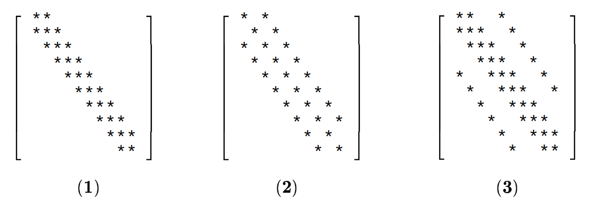
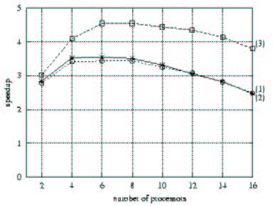
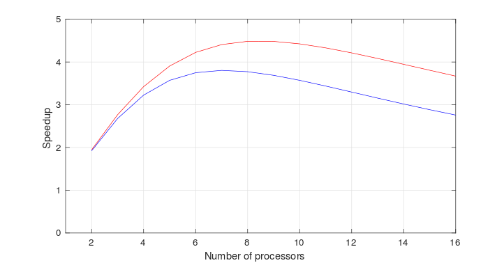

---
layout: default
title: "Amdahl's Law"
--- 

### Theoretical speedup

Applying parallel programming techniques to accelerate an algorithm is a very common task. This section will discuss some of the available theory for making predictions about the maximum speedup that can be achieved.

#### Amdahl's law

[Amdahl's law](https://en.wikipedia.org/wiki/Amdahl%27s_law) relates the maximum achievable speedup of a task to the amount of time that the task executes elements that can be parallelized. This is based on two assumptions:

 - The task can be divided in a serial part and a parallel part.
 - The parallel part scales linearly with the amount of available parallel nodes.

$ T_{total} = T_{serial} + T_{parallel} $

$ Speedup(k) = \frac{T_{total}}{T_{serial} + (\frac{T_{parallel}}{k})} $

$ k $ := number of parallel nodes

As an example, take a task that consist of 95%  parallelizable work. The maximum speedup can never exceed 20, no matter how much parallel nodes are employed.

##### Parallel slowdown

[Parallel slowdown](https://en.wikipedia.org/wiki/Parallel_slowdown) is an effect that can plague certain parallel tasks. Scaling the task beyond a certain amount of parallel nodes causes a runtime increase instead of the expected decrease. This is typically associated with a communications bottleneck, where the time required for communication between the parallelly executed parts grows faster than can be compensated by dividing the workload among the parallel nodes.

#### Compensated Amdahl's law

Amdahl's law assumes that dividing the parallel part of the task among many nodes doesn't inflict any sort of runtime penalty. That assumption is certainly reasonable for embarrassingly parallel workloads, but is not always correct outside of the embarrassingly parallel case.

Amdahl's law can be compensated for this runtime penalty by specifying and additional part of the task, called $\text{T}_{overhead}(k)$, which is modelled as a function of the amount of nodes:

$ T_{total} = T_{serial} + T_{parallel} $

$ Speedup(k) = \frac{T_{total}}{T_{serial} + (\frac{T_{parallel}}{k}) + T_{overhead}(k)}$

$ k $ := number of parallel nodes

The exact relation between $T_{overhead}(k)$ and the amount of nodes is application specific, but two general modelling assumptions seem reasonable:

 - There is no overhead when only one node is available.
 - $T_{overhead}(k)$ consists of a parallelizable and non-parallelizable part.

The first assumption is trivial. The second one states that the tasks constituting the overhead can consist of elements that need to be executed sequentially and elements that can be executed concurrently.

##### Modelling parallel slowdown

Parallel slowdown can be modelled with the compensated Amdahl's law. When it is indeed caused by a communications bottleneck, it seems reasonable to assume the following things:

 - The overhead consists exclusively of non-parallelizable tasks.
 - The overhead scales linearly with the amount of parallel nodes.

Communication between multiple nodes is usually dominated by non-parallelizable tasks, because it often involves some form of causality. The choice of scaling is debatable, but less then linear scaling is very unlikely, whereas more than linear scaling is very common.

The predicted speedup would in this case be:

$ T_{total} = T_{serial} + T_{parallel} $

$ Speedup(k) = \frac{T_{total}}{T_{serial} + (\frac{T_{parallel}}{k}) + ((k - 1) \times T_{overhead})} $

$ k $ := number of parallel nodes

##### Compensated example

In this section, an example will be discussed to illustrate the consequences that the overhead compensation of Amdahl's law can have. Like the previous example, the parallel part of the task is set at 95%. The relation for $T_{overhead}(k)$ is taken from the communications bottlenecked case, with a constant factor of 1% of $T_{total}$.

{:width="900px"}

The maximum speedup of about 4.255 is achieved using 10 parallel nodes, a far cry from the maximum of 20 that the uncompensated Amdahl's law predicted. Using 150 nodes results in a speedup of about 0.65, which is actually a significant performance decrease.

#### Experimental verification

Accelerating iterative solvers by dividing the workload among parallel nodes is a common practice. However, there is a general rule of thumb that the amount of parallel nodes should not be to large in these cases, as the communication between the processes quickly becomes excessive.

[W.M. Zuberek and T.D.P. Perera](http://www.wseas.us/e-library/conferences/2005sofia/papers/500-268.pdf) investigated the scaling behaviour of distributed iterative solvers, focusing on the Gauss-Seidel method. They provide experimental data on the scaling behaviour for three kind of sparsity patterns:

{:width="1000px"}

Density: (1) = 0.015, (2) = 0.015, (3) = 0.025 (Taken from W.M. Zuberek and T.D.P. Perera)

{:width="400px"}

Speedups of distributed iterative solvers (Taken from W.M. Zuberek and T.D.P. Perera)

The above graph shows three things:

 - Parallel slowdown occurs for all three matrices when using more then 8 processors.
 - Sparsity pattern has little effect on the speedup.
 - Density has a significant effect on the speedup.

Worth mentioning is the questionable speedup at 2 processors, having a value of about 3 for all three curves. This is odd because Amdahl's law states that the speedup can never exceed the amount of parallel nodes. It might be explained by some caching effect, where the complete data set doesn't fit in the cache of a single processor, but does fit in the cache of two processors. No mention of this was made by W.M. Zuberek and T.D.P. Perera.

##### Fitted model results

To evaluate the performance of the compensated Amdahl's law, a comparison is made with the experimental data of W.M. Zuberek and T.D.P. Perera.

The model represented by the equation presented at [Modeling parallel slowdown](https://lucasbekker.github.io/Amdahls_law#modelling-parallel-slowdown) was selected for the comparison, because it is expected that the parallel slowdown was caused by a communications bottleneck. $T_{parallel}$ was set to 100% because the algorithm used by W.M. Zuberek and T.D.P. Perera contains no serial part. Some experimenting provided the values of $T_{overhead}$:

{:width="800px"}

Red: $T_{parallel}$ = 100%, $T_{overhead}$ = 1.4%

Blue: $T_{parallel}$ = 100%, $T_{overhead}$ = 2.0%

The results are not too bad. The behaviour in the region between 2 and 6 processors is a little different, but speedups exceeding the number of parallel nodes cannot be explained with Amdahl's law. Some unknown effect must have had a significant influence on the results of the experimental data, but it is generally very uncommon to see this kind of behaviour.

The value of the maximum speedup and the amount of processors required to achieve said speedup are relatively accurate. The experimental results show a slightly less linear and steeper descend then the model, but this just means that the assumption that the overhead scales linearly with the amount of parallel nodes is not completely true. This reflects the discussion of the model provided at section "Modelling parallel slowdown".

The red line models the situation of matrix (3), with a density of 0.025. The blue line models the two other cases with the lower density of 0.015. The higher density situation has a lower overhead, 1.4% versus 2.0%. This appears reasonable, because the higher density results in a higher runtime per processor, while the communication overhead remains unaffected. As $T_{overhead}$ is modelled as a fraction of $T_{total}$, this lower $T_{overhead}$ is to be expected.