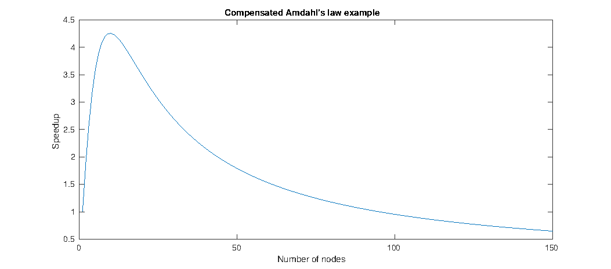

---
layout: default
title: "Amdahl's Law"
--- 

### Theoretical speedup

Applying parallel programming techniques to accelerate an algorithm is a very common task. This section will discuss some of the available theory for making predictions about the maximum speedup that can be achieved.

#### Amdahl's law

[Amdahl's law](https://en.wikipedia.org/wiki/Amdahl%27s_law) relates the maximum achievable speedup of a task to the amount of time that the task executes elements that can be parallelized. This is based on two assumptions:

 - The task can be divided in a serial part and a parallel part.
 - The parallel part scales linearly with the amount of available parallel nodes.

$ T_{total} = T_{serial} + T_{parallel} $

$ Speedup(k) = \frac{T_{total}}{T_{serial} + (\frac{T_{parallel}}{k})} $

$ k $ := number of parallel nodes

As an example, take a task that consist of 95%  parallelizable work. The maximum speedup can never exceed 20, no matter how much parallel nodes are employed.

##### Parallel slowdown

[Parallel slowdown](https://en.wikipedia.org/wiki/Parallel_slowdown) is an effect that can plague certain parallel tasks. Scaling the task beyond a certain amount of parallel nodes causes a runtime increase instead of the expected decrease. This is typically associated with a communications bottleneck, where the time required for communication between the parallelly executed parts grows faster than can be compensated by dividing the workload among the parallel nodes.

#### Compensated Amdahl's law

Amdahl's law assumes that dividing the parallel part of the task among many nodes doesn't inflict any sort of runtime penalty. That assumption is certainly reasonable for embarrassingly parallel workloads, but is not always correct outside of the embarrassingly parallel case.

Amdahl's law can be compensated for this runtime penalty by specifying and additional part of the task, called $\text{T}_{overhead}(k)$, which is modelled as a function of the amount of nodes:

$ T_{total} = T_{serial} + T_{parallel} $

$ Speedup(k) = \frac{T_{total}}{T_{serial} + (\frac{T_{parallel}}{k}) + T_{overhead}(k)}$

$ k $ := number of parallel nodes

The exact relation between $T_{overhead}(k)$ and the amount of nodes is application specific, but two general modelling assumptions seem reasonable:

 - There is no overhead when only one node is available.
 - $T_{overhead}(k)$ consists of a parallelizable and non-parallelizable part.

The first assumption is trivial. The second one states that the tasks constituting the overhead can consist of elements that need to be executed sequentially and elements that can be executed concurrently.

##### Modelling parallel slowdown

Parallel slowdown can be modelled with the compensated Amdahl's law. When it is indeed caused by a communications bottleneck, it seems reasonable to assume the following things:

 - The overhead consists exclusively of non-parallelizable tasks.
 - The overhead scales linearly with the amount of parallel nodes.

Communication between multiple nodes is usually dominated by non-parallelizable tasks, because it often involves some form of causality. The choice of scaling is debatable, but less then linear scaling is very unlikely, whereas more than linear scaling is very common.

The predicted speedup would in this case be:

$ T_{total} = T_{serial} + T_{parallel} $

$ Speedup(k) = \frac{T_{total}}{T_{serial} + (\frac{T_{parallel}}{k}) + ((k - 1) \times T_{overhead})} $

$ k $ := number of parallel nodes

##### Compensated example

In this section, an example will be discussed to illustrate the consequences that the overhead compensation of Amdahl's law can have. Like the previous example, the parallel part of the task is set at 95%. The relation for $T_{overhead}(k)$ is taken from the communications bottlenecked case, with a constant factor of 1% of $T_{total}$.

{:width="900px"}

The maximum speedup of about 4.255 is achieved using 10 parallel nodes, a far cry from the maximum of 20 that the uncompensated Amdahl's law predicted. Using 150 nodes results in a speedup of about 0.65, which is actually a significant performance decrease. 