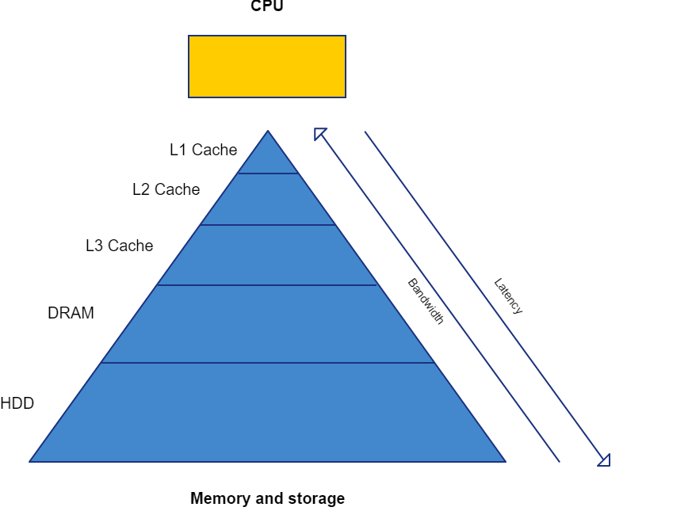

---
layout: default
title: "Basic computer hardware concepts"
--- 

#### Tradional computer model

The traditional computer was designed to perform many different operations on a relatively small amount of data. Because parallelising many different operations on the same data is very hard (or impossible), sequential execution of the operations has long been (still is) the norm. The result is a combination of a few very fast execution units (in the CPU) and a "pyramid shaped" memory/storage system. 

{:width="600px"}

##### Pyramid shape

Creating fast memory is expensive and not all the available data needs to be instantly accessable. Production cost savings led to a small amount of very fast memory close to the execution units, called "Cache". A larger amount of significantly slower memory, called "RAM", acts as the data overflow buffer of the cache. The lowest layer of memory consistes of non-volitile storage, often in the form of an HDD or SSD, which contains the data that the needs to survive a power cycle.

As CPU's grew more capable, and the way in which they where used, changed over the years, additional layers (L2 and L3) of cache where added to accomodate.

##### Bandwidth

Bandwidth is one of two measures of the "speed" of memory, but bandwidth is a broader concept. Bandwidth is a measure of the (maximum) amount of data that can be transferred between a sender and a receiver within a timeframe. Data transfer channels are usually bi-directional, making the distinction between sender and receiver less relevant.

High data transfer rates are desirable, but like storage capacity, are costly to achieve. The traditional computer model benefits most from high memory bandwidth at the cache level and it becomes less important towards the bottom of the "pyramid".

The most common measure for bandwidth is bytes per second, a table of derived units and their meaning is provided below. (A bit is a single one or zero and a byte is a set of 8 bits)

| kilo  | mega  | giga  | terra | bit/byte per second                                                |
|:------|:-----:|:-----:|:-----:|:-------------------------------------------------------------------|
|       |       |       |       |                                                                    |
| Kb/s  | Mb/s  | Gb/s  | Tb/s  | 1.000 - 1.000.000 - 1.000.000.000 - 1.000.000.000.000 bits/second  |
| KB/s  | MB/s  | GB/s  | TB/s  | 1.000 - 1.000.000 - 1.000.000.000 - 1.000.000.000.000 bytes/second |
| Kib/s | Mib/s | Gib/s | Tib/s | 1.024 - 1.048.576 - 1.073.741.824 - 1.099.511.627.776 bits/second  |
| KiB/s | MiB/s | GiB/s | TiB/s | 1.024 - 1.048.576 - 1.073.741.824 - 1.099.511.627.776 bytes/second |

##### Latency