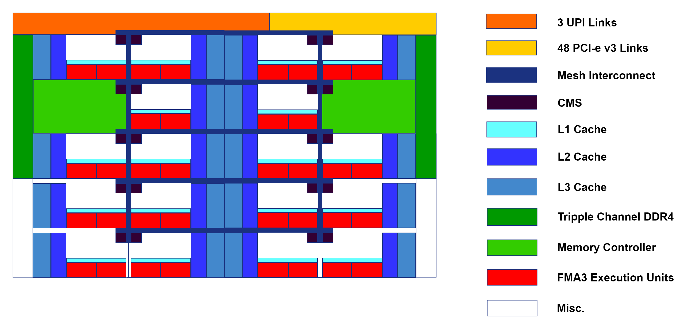

---
layout: default
title: "Computer components"
--- 

#### CPU

##### Basics of a CPU

CPU's are the "beating heart" of a computer, and as such, perform many more tasks than the ones that will be discussed in this text. The focus lies on the floating point calculation capabilities and the memory subsystems, as well as the interfaces.

The traditional CPU ([Central Processing Unit](https://en.wikipedia.org/wiki/Central_processing_unit)) is an Integrated Circuit (IC) that executes the logic, arithmatic, input/output (I/O) and control operations that are prescribed by software running on the computer. As time passed, many other subsystems of computers got integrated into the CPU, making the functions that the traditional CPU performs only a subset of all the functions that a modern CPU performes. A "core" of a modern CPU is a separate unit that performes all the tasks of a traditional CPU.

Modern CPU's are very diverse, complex and multi-faceted, varying wildly with ISA, microarchitecture, intended platform and manufacturer. A discussion about CPU's that would include all these variations would be impossible, necessitating a confinement. This discussion will try to be as generic as possible, but the focus lies on an Intel based server CPU of the "Skylake-SP" microarchitecture.

Intel dominates the PC/laptop as well as the HPC/Supercomputer CPU market, making the restriction towards an Intel x86-64 based CPU justified. Considering the fact that almost all Laptops and workstations contain CPU's that are (to a varying extend) derived from their server oriënted counterparts, focusing the discussion around a server CPU seems logical as well. The Skylake-SP microarchitecture was chosen because it is very recent (at the time of writing), contains some very significant advancements for scientific computing workloads and is used in a cluster available to the MEFD group at the TU/e.

##### System on a Chip

Modern CPU's are best decribed by the ["System on a Chip" (SoC)](https://en.wikipedia.org/wiki/System_on_a_chip) moniker, containing many of the core components of a computer. As such, most contain the following subsystems:

 - Cores
 - Memory controller
 - Cache
 - Interfaces
 - Graphics (included in most consumer oriënted CPU's)

##### ISA and uarch

One of the most important aspects of a CPU is its Instruction Set Architecture ([ISA](https://en.wikipedia.org/wiki/Instruction_set_architecture)), like for example x86, x86-64 and ARM. An ISA is an abstract model of a computer and formes the link between software and hardware. ISA's where introduced to make programming software easier, which could now be written in terms of ISA instructions in stead of low level [machine code](https://en.wikipedia.org/wiki/Machine_code). The most common ISA for CPU's in servers, as well as consumer oriënted computers, is x86-64.

An implementation of an ISA is called a [microarchitecture (uarch)](https://en.wikipedia.org/wiki/Microarchitecture), with performance varying from uarch to uarch. Any specific uarch can also support extensions to its ISA, common examples are VT-d, AES-NI, SSE4 and AVX2. These extensions are additions to the abstract computer model of an ISA and contain specific instructions to accelerate certain tasks of a computer, like AES data encryption, virtualization and vector mathematics.

##### Threads

A [thread](https://en.wikipedia.org/wiki/Thread_(computing)) is a chain of instructions that is to be executed by the CPU. Each thread is generated by a process, which can loosely be described as an instance of a computer program. A single core of a CPU can execute one thread at a time, but using a technique called timeslicing and the concept of [context switching](https://en.wikipedia.org/wiki/Context_switch), can handle multiple threads concurrently.

Multithreading allows a single process to spawn a multitude of threads, deviding the workload of that process. Performance benefits (can) arise when these threads are executed in parallel on multiple cores of a CPU.

##### Intel Xeon Gold 1632

{:width="800px"}

This example CPU is the [Intel Xeon Gold 1632](https://ark.intel.com/products/123541/Intel-Xeon-Gold-6132-Processor-19_25M-Cache-2_60-GHz). 

It contains:
 - 14 cores and 28 threads
 - 6 channel DDR4 ECC memory controller
 - 19.25 MiB L3 cache
 - 14 MiB L2 cache
 - 0.875 MiB L1 cache
 - 48 PCI-e v3.0 lanes
 - 2 AVX-512 FMA units per core