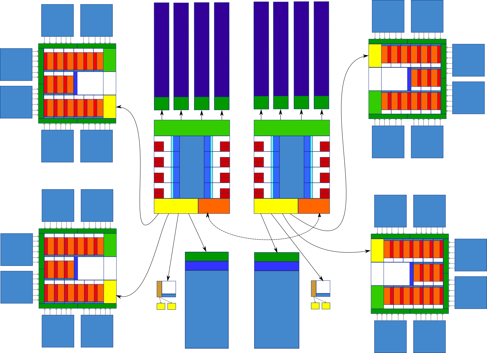

---
layout: default
title: "Computer Hardware Examples"
--- 

#### Dual socket, quad GPU compute node

{:width="1000px"}

A high level block diagram of a dual socket, quad GPU, compute optimized rack server from around 2014/2015. The two CPU's (Central Processing Units) are Intel Xeon units from the Haswell/Broadwell generation. The four GPU's (Graphics processing unit) are NVIDIA Tesla K40 units, from the Kepler generation.

This specific example was chosen because it uses some of the first hardware that was really targeted at (double precision) High Perfomance Computing (HPC), contains enough complexity to accurately represent typical GPGPU compute nodes, but stil resembles consumer hardware at the fundamental levels.