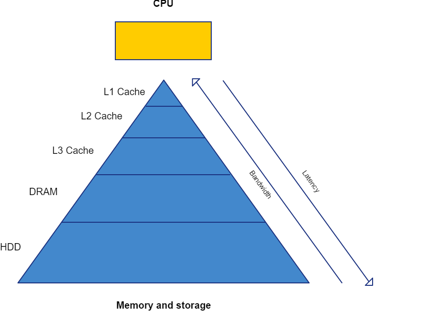

---
layout: default
title: "Computer models"
--- 

#### Traditional computer model

The traditional computer was designed to perform many different operations on a relatively small amount of data. Because parallelising many different operations on the same data is very hard (or impossible), sequential execution of the operations has long been (still is) the norm. The result is a combination of a few very fast execution units (in the CPU) and a "pyramid shaped" memory/storage system. 

{:width="600px"}

##### Pyramid shape

Creating fast memory is expensive and not all the available data needs to be instantly accessable. Production cost savings led to a small amount of very fast memory close to the execution units, called "Cache". A larger amount of significantly slower memory, called "RAM", acts as the data overflow buffer of the cache. The lowest layer of memory consistes of non-volitile storage, often in the form of an HDD or SSD, which contains the data that the needs to survive a power cycle.

As CPU's grew more capable, and the way in which they where used, changed over the years, additional layers (L2 and L3) of cache where added to accomodate.

##### [Bandwidth](https://en.wikipedia.org/wiki/Bandwidth_%28computing%29)

Bandwidth is one of two measures of the "speed" of memory, but bandwidth is a broader concept. Bandwidth is a measure of the (maximum) amount of data that can be transferred between a sender and a receiver within a timeframe. Data transfer channels are usually bi-directional, making the distinction between sender and receiver less relevant.

High data transfer rates are desirable, but like storage capacity, are costly to achieve. The traditional computer model benefits most from high memory bandwidth at the cache level and it becomes less important towards the bottom of the "pyramid".

The most common measure for bandwidth is bytes per second, a table of derived units and their meaning is provided below. (A bit is a single one or zero and a byte is a set of 8 bits)

| kilo  | mega  | giga  | terra | bit/byte per second                                                |
|:------|:-----:|:-----:|:-----:|:-------------------------------------------------------------------|
|       |       |       |       |                                                                    |
| Kb/s  | Mb/s  | Gb/s  | Tb/s  | 1.000 - 1.000.000 - 1.000.000.000 - 1.000.000.000.000 bits/second  |
| KB/s  | MB/s  | GB/s  | TB/s  | 1.000 - 1.000.000 - 1.000.000.000 - 1.000.000.000.000 bytes/second |
| Kib/s | Mib/s | Gib/s | Tib/s | 1.024 - 1.048.576 - 1.073.741.824 - 1.099.511.627.776 bits/second  |
| KiB/s | MiB/s | GiB/s | TiB/s | 1.024 - 1.048.576 - 1.073.741.824 - 1.099.511.627.776 bytes/second |

##### [Latency](https://en.wikipedia.org/wiki/Latency_%28engineering%29)

Memory latency is a highly multifaceted topic, which is largely beyond the scope of this text, but should be understood at a global level to appreciate the performance impact on certain algorithms. Latency, or access time, is defined as the amount of time between a request to a system and the response of the system. Memory latency is the second important measure of the "speed" of memory.

In order to understand memory access time, one must first (roughly) understand how memory is accessed. Computer memory is a highly structured and complex system, with many different layers and subsystems (cache, RAM, HDD). The steps that are required to access data from computer memory are dictated by the structure of the global computer memory system, but also by the local structure of the memory subsytem that contains the data. These local structures can vary pretty significantly from subsystem to subsystem, but they all "group" their resources into "memory blocks", which contain the actual data. The nature of these "blocks" is definded by the precise structure of the specific memory subsystem.

When the user makes a request to access certain (parts) of data, a list of "storage adresses" is generated. This list of "storage adresses" maps to the memory subsystem and corresponding memory blocks that contain the requested data. This list of storage adresses is passed through to the relevant memory subsystem and then gets processed. This results in the data contained in the memory blocks being presented to one or more of the outputs of the memory subsystem in a serial fashion.

The time between the arrival of the storage adresses list and the moment the first block of data is presented, is called latency of that memory subsystem. The total latency of a data access request is the amount of time from the moment a "gather" instruction is issued till the moment that the data is "gathered" (available for manipulation). 

Latency is usually measured in mili/nano seconds, but can also be provided in cycles. This is equivalent to time, because each cycle takes a set amount of time (dependant on operating frequency).

#### Scientific computing

The traditional computer model is optimized to perform many different operations on a small amount of data, but most workloads of a scientific computing nature are characterized by many similar operations on a large amount of data. Take for example a matrix-matrix multiplication, which consists of many floating point multiplications and additions, operating on two large amounts of data. This difference doesn't exclude scientific computing related tasks from running on traditional computers, but the (traditional) hardware is not tailored towards the task, resulting in performance that leaves a lot to be desired.

As the traditional computer became faster, consumers where interested in using their computer for more than just office related workloads. Content creation like photo and video editing, but also gaming, are prime examples of these more modern tasks for the traditional computer. These tasks are like scientific computing tasks, in the sense that they involve floating point operations on large datasets. This resulted in the development of much more powerful graphics cards, specifically for applications that required manipulations on graphical datasets, like decoding (viewing) videofiles or playing videogames.

Meanwhile, scientific applications did not really see the development of specialized hardware. The only way to scale the performance of these tasks was to devide the workload amongst many "traditional" computers organized in "clusters", relying on hardware that was developed mostly for hosting large relational databases. Database related workloads require fast non-volitile storage and the ability to handle many different requests. These requirements are similar to those of scientific computing, but are still very different in key aspects. Firstly, a request to a relational database does not require floating point operations. Second, the scale of relational databases often approach the terabyte range, making the capacity of RAM woefully insufficiant. Typical medium to large scale scientific computing workloads don't exceed more than a couple of gigabyte of data, and as such are best stored in RAM.

The big game changing moment for scientific computing came when certain scientists realised that graphics cards, developed for consumers, could be very suitable for the needs of scientific computing. The only real problem was that the applications had to be programmed using graphics API's, like DirectX, making the process of writing simulations very difficult and restrictive. One of the main producers of graphics cards, NVIDIA, saw this problem and decided to alleviate some of these dificulties by making (relatively) slight modifications to graphics cards. The result, CUDA cores and CUDA toolkit, allowed for much easier and less restricted access to the resources provided by graphics cards for scientific computing workloads.

#### Traditional vs Massively Parallel computer model

The Massively Parallel ([MP](https://en.wikipedia.org/wiki/Massively_parallel)) computer model differs from the traditional computer model in many ways because it focusses on simultanious execution of computations. To understand why parallel execution is fundamental for scientific computing, a very low level problem called the "power wall" should be explained.

CPU's and GPU's are made from transistors, which can be switched "on" or "off". A transistor is on when electrical current can flow through it, making it conductive. A transistor is off when electrical current cannot flow through it, making it non-conductive (hence the term semiconductors). Switching the state of a transistor requires a small amount of electrical current, the energy of that current needs to be dissipated in the form of heat. When a transistor is required to switch ever faster, because the performance of a CPU (or GPU) scales linearly with it's operating frequency, the current required to switch the state of the transistor also increases. The kicker is that the amount of current required to switch the state of a transistor scales quadratically with the switching frequency (caused by parasitic capacitance at the transistor). The final result is that attempts to increase the performance of a CPU or GPU by increasing its operating frequency are frustrated by a quadratic increase in power consumption and heat production, which at some point makes increasing the operating frequency impossible. This limit is called the "power wall".

Scaling the performance of a CPU or GPU by increasing the amount of execution units or cores has no such problems, but faces other dificulties, the biggest of which is causality. When the result of problem X is (deterministically) dependent on the result of problem Y, it follows that problem Y should be solved before problem X can be solved. These types of situations are extremely difficult (or impossible) to accelerate with parallel execution.

Many scientific computing workloads, like the aforementioned example of matrix-matrix multiplication, are known to be ["embarrassingly parallel"](https://en.wikipedia.org/wiki/Embarrassingly_parallel). This means that parallel execution isn't hindered by causality related problems and as such yields the greatest performance (per Watt) on massively parallel systems, like GPU's.