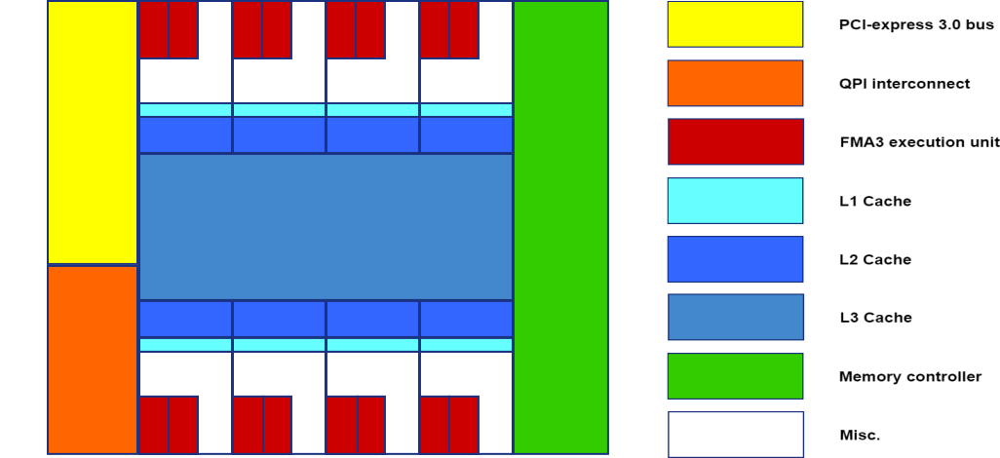

---
layout: default
title: "Hardware"
--- 

#### floating point data

Floating point (FP) data is a common way to store real numbers [(R)](https://en.wikipedia.org/wiki/Real_number). Many different types of floating point datatypes exist, but the most relevent types for scientific computing are:

 - Double (FP64)
 - Single (FP32)
 - Half (FP16)

[**Double** (64 bit)](https://en.wikipedia.org/wiki/Double-precision_floating-point_format):

Common format for sensitive mathematical equations, like solving ill conditioned systems. Default datatype of MATLAB.

$$ Value = -Sign_{2} \times 2^{(Exponent_{2} - 1023)} \times (1 + Mantissa_{2}) $$

 - 1 bit: sign
 - 11 bit: exponent
 - 53 bit: mantissa

Resolution: $$ (1/2)^{52} = 2.2204e-16 $$

Exponent range: $$ 2^{([-1023,1024])} $$

[**Single** (32 bit)](https://en.wikipedia.org/wiki/Single-precision_floating-point_format):

Original floating point datatype used in 32 bit computers, provides sufficient resolution for many mathematical operations.

$$ Value = -Sign_{2} \times 2^{(Exponent_{2} - 127)} \times (1 + Mantissa_{2}) $$

 - 1 bit: sign
 - 8 bit: exponent
 - 23 bit: mantissa

Resolution: $$ (1/2)^{23} = 1.1921e-07 $$

Exponent range: $$ 2^{([-127,128])} $$

[**Half** (16 bit)](https://en.wikipedia.org/wiki/Half-precision_floating-point_format):

Relatively coarse approximation of a real number, but sometimes good enough. A great example of aplications that usually don't require more precision are  deep neural networks.

$$ Value = -Sign_{2} \times 2^{(Exponent_{2} - 15)} \times (1 + Mantissa_{2}) $$

 - 1 bit: sign
 - 5 bit: exponent
 - 10 bit: mantissa

Resolution: $$ (1/2)^{52} = 9.7656e-04 $$

Exponent range: $$ 2^{([-15,16])} $$

#### Performance analysis

GPGPU acceleration of mathematical problems centers around runtime performance. Enhancing the performance of a software routine becomes easier if certain basic concepts about computer hardware are familiar. The best performance can only be acchieved if the (machine) code is tailord towards the hardware on which the code will be executed.

Basic hardware concepts, and a couple of more advanced ones, will be discussed using a few examples:

##### Dual socket, quad GPU compute node

{:width="1000px"}

A high level block diagram of a dual socket, quad GPU, compute optimized rack server from around 2014/2015. The two CPU's (Central processing Units) are Intel Xeon units from the Haswell/Broadwell generation. The four GPU's are NVIDIA Tesla K40 units, from the Kepler generation.

This specific example was chosen because it uses some of the first hardware that was really targeted at (double precision) High Perfomance Computing (HPC), contains enough complexity to accurately represent typical GPGPU compute nodes, but stil resembles consumer hardware at the fundamental levels.

##### CPU

{:width="500px"}

This example CPU is the [Intel Xeon E5-2667v3](https://ark.intel.com/products/83361/Intel-Xeon-Processor-E5-2667-v3-20M-Cache-3_20-GHz). 

It contains:

 - 8 cores and 16 threads.
 - 20 MB L3 cache
 - 40 PCI-e 3.0 lanes
 - Quad channel DDR4 ECC memory controller
 - 2 QPI 9.6 GT/s links

The CPU is the "beating heart" of a computer, and as such, performes many more tasks than the ones that will be discussed here. The focus lies on the floating point calculation capabilities and the memory subsystems, as well as the interfaces.